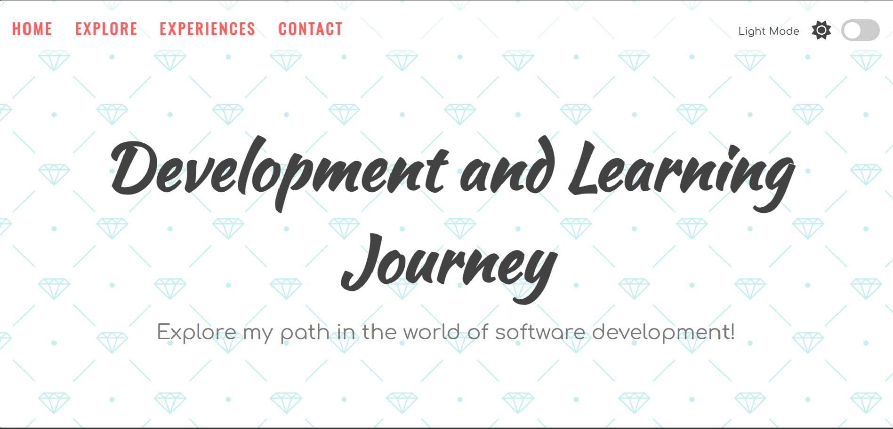
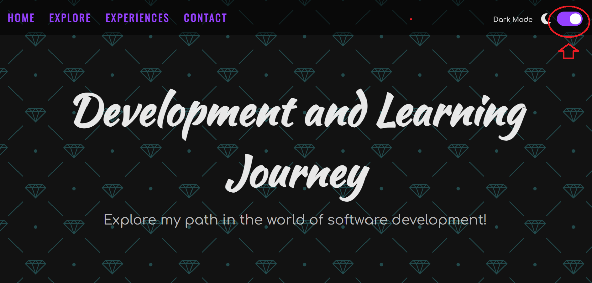

# Development and Learning Journey

> Explorează călătoria mea în lumea dezvoltării software!

## Descriere

Acest proiect reprezintă un site simplu care prezintă călătoria mea în lumea dezvoltării software. Poți explora experiențele mele, proiectele și articolele recente.

## Caracteristici

- **Teme Light și Dark:** Comută între modurile de temă light și dark pentru o experiență personalizată.
- **Navigare Simplă:** Folosește meniul de navigare pentru a accesa secțiunile site-ului.
- **Articole Recente:** Descoperă cele mai recente articole și tutoriale în domeniul dezvoltării software.

## Demo

Vezi proiectul în acțiune [aici](#).

## Cum să Folosești

1. Accesează [demo-ul proiectului](#).
2. Explorează secțiunile site-ului utilizând meniul de navigare.
3. Comută între modurile de temă light și dark pentru a alege preferințele tale.

## Capturi de Ecran

## Cum să Contribui

Dacă dorești să contribui la îmbunătățirea acestui proiect, urmează acești pași:

1. **Clonează Proiectul:** `git clone https://github.com/nume-utilizator/nume-proiect.git`
2. **Creează o Ramură Nouă:** `git checkout -b feature/Contribuie`
3. **Adaugă și Comitează Schimbările:** `git commit -am 'Adaugă funcționalitatea X'`
4. **Trimite Schimbările:** `git push origin feature/Contribuie`
5. **Deschide un Pull Request:** Deschide un PR pe GitHub pentru a revizui și a aduce schimbările tale în proiect.

## Tehnologii Folosite

- HTML
- CSS
- JavaScript

## Autor

Numele Autorului - [@nume-utilizator](https://github.com/nume-utilizator)

---

**Notă:** Acest README este doar un șablon. Modifică-l pentru a se potrivi nevoilor specifice ale proiectului tău.
